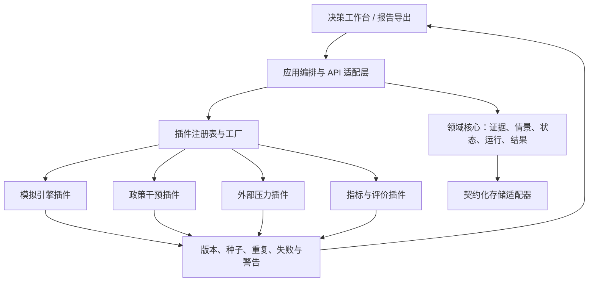
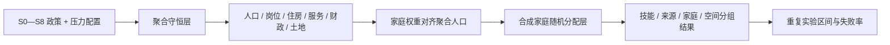

# 技术架构｜Policy Sandbox

## 1. 架构原则

1. **领域核心独立**：政策、情景、家庭状态、运行和结果对象不依赖 Web、数据库或模型供应商。
2. **证据链先于界面**：事实字段必须携带来源与定位；LLM 输出不得直接覆盖事实。
3. **插件而非分支堆叠**：引擎、干预、压力和指标通过注册表/工厂扩展。
4. **配置驱动**：参数从版本化配置进入，禁止把地区响应写死在插件构造中。
5. **可复现与可否证**：记录种子、输入摘要、插件版本、警告、失败原因和输出摘要。
6. **情景解释优先**：默认展示机制、假设、群体差异和敏感性，不只给单一分数。
7. **双层权威分工**：聚合层负责守恒，合成家庭层负责分配；微观样本不反向篡改总量账。

## 2. 逻辑分层

## 3. 模块责任

| 模块 | 责任 | 禁止耦合 |
|---|---|---|
| `domain` | 通用领域对象与不变量 | Web、数据库、大模型 SDK |
| `domains` | 领域状态、守恒、编译、微观行为与指标 | UI、真实数据硬编码 |
| `application` | 单次运行、重复实验、生命周期和结果信封 | 具体插件实现 |
| `plugins` | 注册表、工厂、协议与实现 | UI 逻辑 |
| `adapters`（后续） | 文档、存储、API、报告和模型供应商 | 反向污染领域对象 |
| `schemas` | 跨进程/跨语言稳定契约 | 实现细节 |
| `audit`（后续） | 哈希、版本、日志、复现与风险标记 | 修改模拟结果 |

## 4. 运行时流程

1. 验证领域、政策、压力、微观行为和随机实验配置；
2. 生成输入摘要，冻结场景版本；
3. 由注册工厂创建领域、引擎、干预和压力插件；
4. 政策与压力只编译配置中显式可见的合成效应；
5. 聚合引擎更新人口、岗位、住房、服务、财政和土地账；
6. 合成家庭权重对齐聚合人口，再执行迁移、就业、落户、住房和服务分配；
7. 容量超限或守恒失败立即终止，不用警告掩盖；
8. 单次运行输出总体、分组和风险；重复实验输出均值、分位数、标准差和失败率；
9. 决策适配器在 I4 生成方案比较、一页纸与审计包。

## 5. 插件体系

注册对象分五类：

- `domain`：问题树、配置约束、适用尺度和模块目录；
- `simulation_engine`：确定性基线、参数化微观模拟、ABM、系统动力学或混合引擎；
- `intervention`：供给、资格、设施、财政、土地等政策动作；
- `pressure`：就业、财政、迁移、人口结构和极端事件等外部冲击；
- `metric`：效率、公平、可达性、财政、生态和风险指标。

注册要求：

- 注册名在类别内唯一；重复注册立即失败；
- 未知插件名显式报错并列出可用项；
- 插件构造只接收配置对象；
- 插件公开名称、版本、领域、适用尺度和假设；
- 自动发现只扫描约定包，私有模块以下划线开头并跳过；
- 导入错误不吞掉，便于维护者定位。

## 6. 新型城镇化双层模型

家庭层使用固定合成记录和动态权重。家庭成员构成变化保持户内人口守恒；总人口变化仍由聚合人口方程决定。就业、住房、教育和医疗分配不得超过相应聚合容量。

## 7. 模拟引擎演进

| 阶段 | 引擎 | 状态 | 发布口径 |
|---|---|---|---|
| M0 | deterministic baseline | 已实现 | 纯合成演示 |
| M1 | 参数化微观模拟 | 软件纵切已实现，U6 待校准 | 条件情景 / Demo |
| M2 | 规则型 ABM | 未开始 | 实验性 |
| M3 | LLM agent adapter | 未开始 | 可选、隔离、不可作事实源 |

LLM 智能体不进入默认执行路径。其输出必须经过结构化约束、重复试验、稳定性评估和事实字段隔离。

## 8. 数据与部署边界

MVP 使用 JSON/JSONL 作为可移植交换格式。数据分为事实、假设、状态、结果和审计五层；合成家庭属于状态层，不得与个人数据混同。首版本地优先，未来 Web 部署必须新增身份认证、租户隔离、文件扫描、任务队列、资源限额和审计日志。

## 9. 待 ADR 决策

- Web/API 框架；
- 持久化与任务队列；
- 插件包发布与兼容性策略；
- 领域数据许可和版本治理；
- LLM 适配器的离线/在线执行边界。
