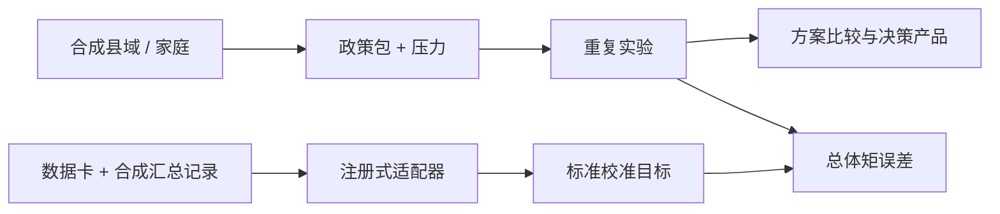

# 新型城镇化领域插件｜总入口

> 注册名：`new_urbanization`  
> 当前状态：`demo`  
> 当前版本：`0.6.0`  
> 政策基线日期：2026-08-19

## 核心问题

在不同人口流动、产业就业、空间区位和资源约束条件下，哪一组政策能够以可承受的财政、土地与治理成本，使农业转移人口和其他常住人口实现稳定就业、安居与基本公共服务平等，同时避免盲目扩张、债务、生态和收缩风险？

## 当前实现

- 五类合成县域、六模块聚合守恒层和一万户合成家庭；
- 七类政策工具、S0—S8 九情景和五类压力插件；
- 迁移、就业、落户、住房和服务随机分配及四维群体结果；
- 共同随机数重复、三类比较模式、群体差距和财政土地风险台账；
- 无权重 Pareto 前沿、一页纸摘要和机器审计包；
- 注册式汇总数据适配器、数据卡、八指标词典和来源追踪；
- 合成校准 fixture 与适配—实验—总体矩校准闭环。

当前唯一数据适配器明确 `accepts_real_data=false`。合成校准通过只证明软件和契约可运行，不能作为 U6 现实有效性证据。

## 系统结构

## 文档导航

1. `POLICY_AND_QUESTION_TREE.md`：政策基线和高层问题树；
2. `CONCEPTUAL_MODEL.md`：主体、机制、空间、时间和反馈；
3. `INDICATORS_AND_DATA.md`：结果指标、状态变量、数据分级和许可；
4. `EXPERIMENT_AND_VALIDATION.md`：情景、压力、校准、重复和发布门；
5. `DECISION_PRODUCTS.md`：比较、摘要和审计接口；
6. `DATA_ADAPTER_PROTOCOL.md`：数据卡、指标映射和真实接入门；
7. `MODEL_CARD.md`：用途、局限、群体诊断和验证状态；
8. `IMPLEMENTATION_ROADMAP.md`：分阶段开发顺序；
9. `RISK_REGISTER.md`：领域与产品风险；
10. `I5A_VALIDATION.json`：适配器与合成校准机器验证。

任何情景若只提高城镇化率而恶化稳定就业、住房负担、服务可及、群体公平或财政可持续性，不得判为“更优”。系统不生成单一判断，只提供分目标证据和权衡集合。
